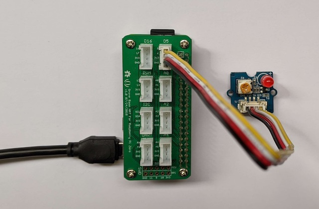

# Getting Started with Python on Raspberry Pi

1. [Prerequisites](#prerequisites)
2. [Hardware](#hardware)
3. [Update Raspian](#update-raspian)
4. [Check Python Version](#check-python-version)
5. [Install Blinka](#install-blinka) or [Install Grove](#install-grove)
6. [Keep running](#keep-running)

## Prerequisites

The following steps require a Raspberry Pi Zero W with Raspberry Pi OS Lite, a Linux operating system. To install it, see [Raspberry Pi Zero W Setup](https://github.com/fhnw-imvs/fhnw-idb/wiki/Raspberry-Pi-Zero-W#setup). Make sure to [configure Wi-Fi](https://github.com/fhnw-imvs/fhnw-idb/wiki/Raspberry-Pi-Zero-W#1-flash-raspberry-pi-os-bookworm-onto-an-sd-card) and [enable SSH access](https://github.com/fhnw-imvs/fhnw-idb/wiki/Raspberry-Pi-Zero-W#1-flash-raspberry-pi-os-bookworm-onto-an-sd-card) so you can [find your Pi](https://github.com/fhnw-imvs/fhnw-idb/wiki/Raspberry-Pi-Zero-W#2-boot-the-raspberry-pi-and-connect-via-ssh), if your computer is in the same local Wi-Fi network.

## Hardware

* [Raspberry Pi Zero W](https://github.com/fhnw-imvs/fhnw-idb/wiki/Raspberry-Pi-Zero-W) controller.
* [Grove Base Hat for Raspberry Pi](https://github.com/fhnw-imvs/fhnw-idb/wiki/Grove-Adapters#grove-base-hat-for-raspberry-pi) to connect sensors.
* [Grove Red LED](https://github.com/fhnw-imvs/fhnw-idb/wiki/Grove-Actuators#led) wired to Grove _D5_ (see figure 1).

<table><tr><td></td></tr></table>

Figure 1: The LED is connected to Pin `D5`.

## Update Raspian

Update Raspberry Pi OS Lite to the latest version (this process may take some time):

```shell
sudo apt update
sudo apt upgrade
```

## Check Python Version

A fresh installation of the Raspberry Pi OS Lite has **Python 3 preinstalled**. Check this with:

```shell
python --version
```

You need to install `pip3` to be able to download python packages to your project. Install `pip3` as follows:

```shell
sudo apt-get install python3-pip
pip --version
```

and the output should be:

```shell
pip 23.0.1 from /usr/lib/python3/dist-packages/pip (python 3.11)
```

**Optional:** If you don't have Python3 installed, install it with:

```shell
sudo apt update
sudo apt install python3
```

The [python documentation](https://www.raspberrypi.org/documentation/usage/python/) includes chapters on [installing libraries](https://www.raspberrypi.com/documentation/computers/os.html#installing-python-libraries) and using [GPIO in Python](https://www.raspberrypi.org/documentation/usage/gpio/python/README.md).

## Raspberry Pi OS Bookworm

**Note:**  
If you are using _Raspberry Pi OS Bookworm_, check [this information](https://www.raspberrypi.com/documentation/computers/os.html#python-on-raspberry-pi).

## Install Blinka

**Note:** The advantage of this approach is that you can use the same CircuitPython code on the Raspberry Pi as on the microcontroller.

Install the [Blinka Python package](https://github.com/adafruit/Adafruit_Blinka) with the following steps, based on [this tutorial](https://learn.adafruit.com/circuitpython-on-raspberrypi-linux/installing-circuitpython-on-raspberry-pi) by Adafruit:

Frist create a [Virtual Environment](https://learn.adafruit.com/python-virtual-environment-usage-on-raspberry-pi) for the first blinka project `led`.

```shell
mkdir blinka-led
cd blinka-led
python -m venv venv
```

Activate the virtual environment (every time the Pi is rebooted):

```bash
source venv/bin/activate
```

Install the Adafruit packages with:

```bash
pip install Adafruit-Blinka
```

and create the file `led.py` based on the [Blinka Test Example](https://github.com/adafruit/Adafruit_Blinka?tab=readme-ov-file#usage-example):

```python
import time
import board
import digitalio

# setup
PIN = board.D5

print("hello blinky!")

led = digitalio.DigitalInOut(PIN)
led.direction = digitalio.Direction.OUTPUT

# main loop
while True:
    led.value = True
    time.sleep(0.5)
    led.value = False
    time.sleep(0.5)
```

Connect the [LED](https://github.com/fhnw-imvs/fhnw-idb/wiki/Grove-Actuators#led) to pin D5 and run the application with:

```shell
python led.py
```

## Install Grove

**Note:** If you want to work with pure Python programming, you must install the corresponding Python package in order to access the hardware.

To access the GPIOs on the Pi and work with Grove sensors and actuators we use the [Grove Python package](https://github.com/Seeed-Studio/grove.py).

```shell
mkdir grove-led
cd grove-led
python -m venv venv
```

Activate the virtual environment (every time the Pi is rebooted):

```bash
source venv/bin/activate
```

Install the Grove Python package with:

```shell
pip install grove.py
```

and create the file `led.py` based on the [Grove Test Example](https://github.com/Seeed-Studio/grove.py/blob/master/doc/README.md#grove---led):

```python
import time
from grove.grove_led import GroveLed

# setup
PIN = 5 # D5
led = GroveLed(PIN)

print("hello blinky!")

# main loop
while True:
    led.on()
    time.sleep(0.5)
    led.off()
    time.sleep(0.5)
```

Connect the [LED](https://github.com/fhnw-imvs/fhnw-idb/wiki/Grove-Actuators#led) to pin D5 and run the application with:

```shell
python led.py
```

Here are some more [code examples](https://github.com/Seeed-Studio/grove.py/blob/master/doc/README.md#gui-graphical-user-interface) by Seeed Studio.

## Keep running

To keep running a application, even after a reboot, it must be installed as a **systemd service**. Use `systemctl` and  the service file [blink.service](blink.service) to start the python program as system service. Follow these [instructions](https://www.raspberrypi.com/documentation/computers/using_linux.html#the-systemd-daemon) to install the program as a service.

Note:

* If you use print statements in your python program, you can see them using the tool `journalctl`:

  ```shell
  journalctl -f -u blink.service
  ```
